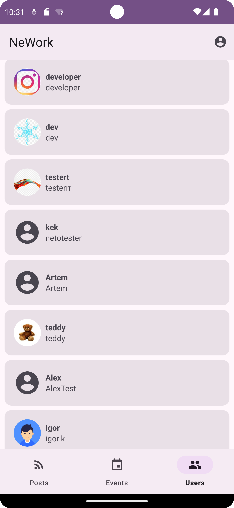

# NeWork App

## Дипломный проект по курсу "Android разработчик с нуля" - приложение для Android "NeWork".

Приложение представляет из себя социальную сеть, которая позволит пользователям создавать посты и события, указывать свои места работы.

В зависимости от системных настроек телефона, в приложении реализованы:
* Светлая/ темная тема
* Локализация En (по умолчанию), Ru

### Инструменты:
* Android Studio
* Kotlin
* Material3
* Retrofit
* Dagger Hilt
* Swagger
* Yandex MapKit
* Figma
* Git + GitHub

## Скриншоты

### Стартовый экран. Экраны входа и регистрации.

   

### Экраны пользователя.

  

### Основные экраны.

  
  